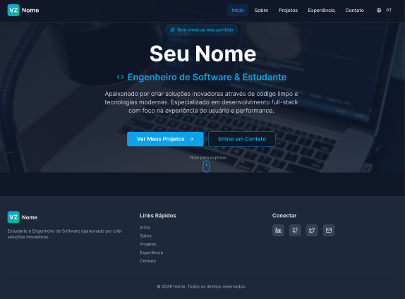
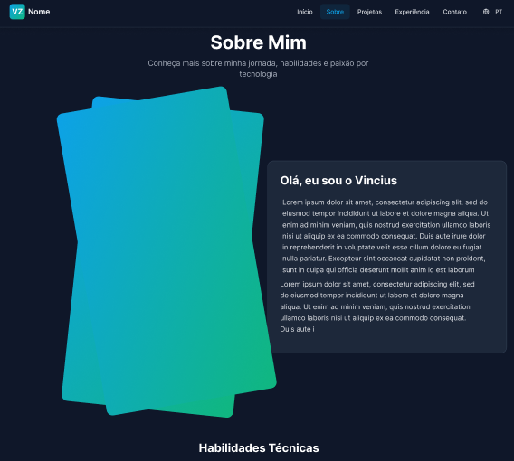
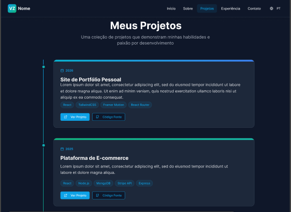
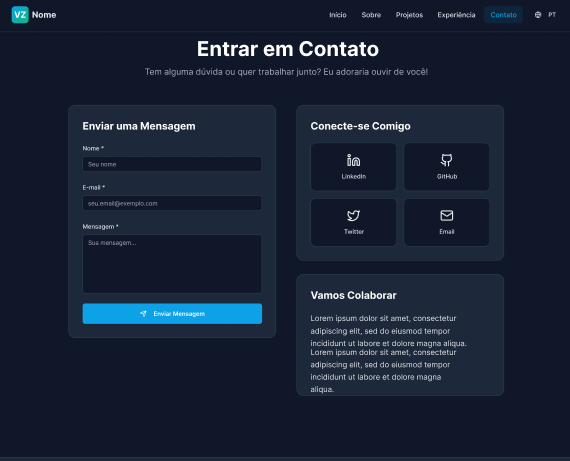

# 🧑‍💻 Portfólio — Vinicius Zegarra Palhares

Portfólio digital moderno e interativo desenvolvido em React, apresentando meus projetos, habilidades técnicas e experiências profissionais.

---

## 🚧 Status do Projeto

🟢 **Em produção**

---

## 🔗 Links

- **Demo Online:** [portfolio2026.vercel.app](https://portfolio2026.vercel.app)
- **GitHub:** [github.com/ZegarraV](https://github.com/ZegarraV)
- **LinkedIn:** [linkedin.com/in/vinicius-zegarra-palhares](https://www.linkedin.com/in/vinicius-zegarra-palhares/)

---

## 📖 Sobre o Projeto

Portfólio desenvolvido para apresentar minha trajetória profissional, projetos e habilidades como desenvolvedor. O projeto foi construído com foco em performance, responsividade e experiência do usuário, utilizando animações modernas e suporte a múltiplos temas e idiomas.

---

## 🖼️ Screenshots

<div align="center">

| Home | Sobre |
|---|---|
|  |  |

| Projetos | Contato |
|---|---|
|  |  |

</div>

---

## ✨ Funcionalidades

- 🌐 **Suporte a dois idiomas** — Português e Inglês
- 🎨 **3 temas** — Dark, Light e Purple
- 📱 **Layout responsivo** — adaptado para desktop e mobile
- ✉️ **Formulário de contato** — integrado com EmailJS
- 💼 **Página de experiências** — com logos das empresas
- 🚀 **Projetos do GitHub** — carregados dinamicamente via API
- 🎞️ **Animações fluidas** — com Framer Motion

---

## 🛠 Tecnologias Utilizadas

| Tecnologia | Uso |
|---|---|
| React | Biblioteca principal |
| Vite | Build tool |
| TailwindCSS | Estilização |
| Framer Motion | Animações |
| React Router | Navegação |
| EmailJS | Envio de emails |
| Lucide React | Ícones |

---

## ⚙️ Instalação e Execução

### Pré-requisitos

- Node.js 18+
- npm

### Passos

```bash
# Clone o repositório
git clone https://github.com/ZegarraV/Portfolio2026.git

# Entre na pasta do projeto
cd Portfolio2026/apps/web

# Instale as dependências
npm install

# Execute o servidor de desenvolvimento
npm run dev
```

A aplicação estará disponível em: `http://localhost:5173`

---

## 🔐 Variáveis de Ambiente

Crie um arquivo `.env` dentro de `apps/web/` com as seguintes variáveis:

```env
VITE_EMAILJS_SERVICE_ID=seu_service_id
VITE_EMAILJS_TEMPLATE_ID_FOR_ME=seu_template_id
VITE_EMAILJS_TEMPLATE_ID_FOR_SENDER=seu_template_sender_id
VITE_EMAILJS_PUBLIC_KEY=sua_public_key
```

---

## 🚀 Deploy

```bash
npm run build
```

Os arquivos de produção serão gerados na pasta `dist/`.

O projeto está configurado para deploy automático na **Vercel** — qualquer push na branch `main` gera um novo deploy.

---

## 📂 Estrutura de Pastas

```
Portfolio2026/
└── apps/
    └── web/
        ├── public/
        └── src/
            ├── components/     # Header, Footer, UI
            ├── pages/          # Home, About, Projects, Experience, Contact
            ├── context/        # ThemeContext, LanguageContext
            ├── data/           # translations.json
            ├── config/         # EmailJS config
            └── hooks/          # use-toast
```

---

## 👤 Autor

**Vinicius Zegarra Palhares**  
Estudante de Engenharia de Software — PUC Minas

[](https://www.linkedin.com/in/vinicius-zegarra-palhares/)
[](https://github.com/ZegarraV)
[](mailto:zegarravdev@gmail.com)

---

## 📄 Licença

Este projeto está sob a licença **MIT**.
